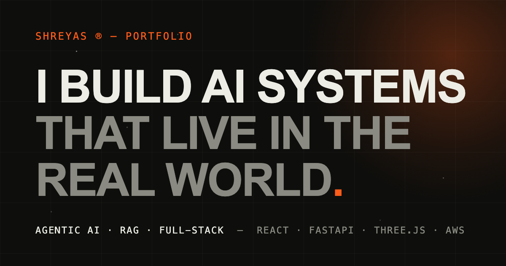

<div align="center">



# Shreyas — Portfolio

**A cinematic, WebGL-driven personal portfolio.**
Custom GLSL shaders · buttery smooth scroll · day & night themes · zero frameworks, zero backend.

### [**View it live →**](https://shreyas-portfolio-virid.vercel.app/)


</div>

---

## ✨ Features

- **Interactive 3D hero** — a noise-displaced sphere written in custom GLSL that reacts to cursor position and velocity, surrounded by a drifting particle field
- **Day / night themes** — one toggle re-colors the whole site *including* the WebGL scene and generated artwork; choice persists, applied before first paint (no flash)
- **WebGL hover distortion** — project thumbnails ripple with an RGB-split shader on hover; supports both images and looping videos (`VideoTexture`)
- **Generated cover art** — projects without real screenshots get procedurally drawn poster-style covers (canvas), themed and cached
- **Cinematic motion** — preloader with progress counter, per-character text reveals, accent wipe transitions, Lenis smooth scrolling, scrollspy navigation
- **Fully data-driven content** — projects, experience, education, certifications and languages live in two plain JS files

## 🛠 Tech Stack

| Layer | Choice |
|---|---|
| Build | [Vite](https://vitejs.dev) |
| 3D / Shaders | [Three.js](https://threejs.org) + hand-written GLSL (no plugins) |
| Animation | [GSAP](https://gsap.com) + ScrollTrigger |
| Scrolling | [Lenis](https://lenis.darkroom.engineering) |
| Styling | Plain CSS with design tokens (custom properties) |
| Hosting | Any static host — no backend required |

## 🚀 Getting Started

```bash
git clone https://github.com/shreyascode11/shreyas-portfolio.git
cd shreyas-portfolio
npm install
npm run dev        # → http://localhost:5173
```

| Command | What it does |
|---|---|
| `npm run dev` | Dev server with live reload — use this while editing |
| `npm run build` | Production build → `dist/` |
| `npm run preview` | Serve the built `dist/` at `localhost:4173` |

## 📁 Project Structure

```
src/
├── main.js                 Boot, capability detection, data rendering,
│                           single render loop (IntersectionObserver-gated)
├── gl/
│   ├── Renderer.js         WebGLRenderer wrapper — DPR cap, disposal
│   ├── Hero.js             Displaced sphere + particles (theme-aware)
│   ├── ImageDistortion.js  Hover ripple over thumbnails (image & video)
│   └── placeholder.js      Procedural cover cards, cached per theme
├── shaders/                GLSL as template literals (noise, hero, distortion)
├── modules/                Preloader · SmoothScroll · Cursor · Theme ·
│                           Menu · Nav (scrollspy) · PageTransition · Reveal
├── data/
│   ├── projects.js         ← add a project here, everything updates
│   └── profile.js          ← experience, education, certs, languages
└── styles/
    ├── tokens.css          ← every color, size and easing (both themes)
    └── main.css            Component styles

public/
├── assets/projects/        Project thumbnails (.jpg / .mp4)
├── assets/certs/           Certificate files (cards link to them)
├── og.png                  Social share card (1200×630)
└── 404.html                Custom not-found page
```

## ✏️ Customization

| To change… | Edit… |
|---|---|
| Projects (name, blurb, tech, links, media) | `src/data/projects.js` |
| Experience / education / certifications | `src/data/profile.js` |
| Colors, typography, spacing, both theme palettes | `src/styles/tokens.css` |
| Hero blob behavior (amplitude, speed, colors) | constants atop `src/shaders/hero.js` + palettes in `src/gl/Hero.js` |
| Hover distortion strength / RGB split | constants atop `src/shaders/distortion.js` |
| Copy (hero statement, bio, freelance offers) | `index.html` |

Drop real screenshots or screen-recordings into `public/assets/projects/` matching the paths in `projects.js` — until then, generated covers keep the design intact.

## ⚡ Performance & Accessibility

- Three.js is **lazy-loaded behind the preloader** — the initial bundle is ~55 KB gzipped
- GL scenes **only render while on screen**; marquee pauses offscreen; `devicePixelRatio` capped at 1.75
- **`prefers-reduced-motion`** gets native scroll, no split-text animation, and a static hero
- Real heading hierarchy, skip link, keyboard-visible focus, and split-text animations keep a **screen-reader-readable copy** of every heading
- Graceful degradation: no WebGL / lost GPU context / blocked localStorage all fall back cleanly

## 📦 Deploying

`npm run build`, then host `dist/` on any static platform (Vercel · Netlify · GitHub Pages · S3+CloudFront). With Vercel, just import the repo — zero config. After deploying, point the `og:image` meta in `index.html` at your live domain.

---

<div align="center">

**Shreyas** — Full-Stack & AI Developer

[GitHub](https://github.com/shreyascode11/) · [LinkedIn](https://www.linkedin.com/in/shreyas1102/) · [Email](mailto:shreoriginal@gmail.com)

</div>
